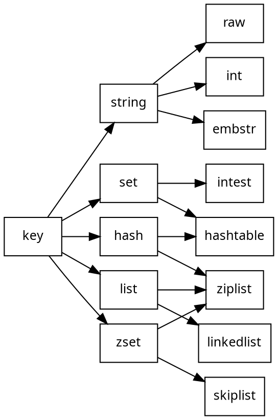

其他/數據結構和內部編碼
===
[返回目錄](../../index.md)

```graphviz
digraph hierarchy {
	nodesep=0.2

	graph [rankdir=LR, overlap=false]
	node [fontname=微軟正黑體, shape=box, fontsize="12pt"]
	edge [style=normal]

	key->{string hash list set zset}
	string->{raw int embstr}
	hash->{hashtable ziplist}
	list->{linkedlist ziplist}
	set->{hashtable intest}
	zset->{skiplist ziplist}
}
```