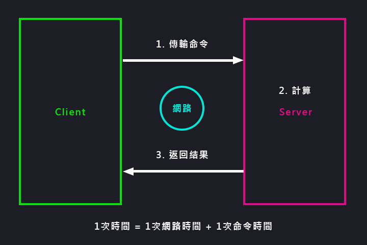
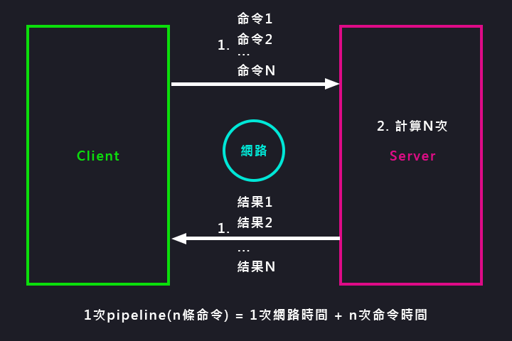

待分類/pipeline
===
[回首頁](https://github.com/frank575/nn/) / [返回目錄](../../)

用於解決網路時間緩慢的問題，以下從網路命令通信模型講起

# 網路命令通信模型



(一次網路命令通信模型圖)

> 至於批量網路命令也是比照上圖的順序，依序返回，所以為 n次時間 = n次網路時間 + n次命令時間

我們可以知道命令時間非常快而網路時間較慢，那我們如何實現批量 get 該如何節省時間？

或者是如何讓多種命令同時發送？

# 什麼是流水線(pipeline)



(一次pipeline通信模型)

> 就是 1次pipeline(n條命令) = 1次網路時間 + n次命令時間

## 與 N 個命令操作進行對比

命令|n個命令操作|1次pipeline(n個命令)
---|---|---
時間|n次網路 + n次命令|1次網路 + n次命令
數據量|1條命令|n條命令

## 兩點注意事項

1. Redis 的命令時間是微秒級別
2. pipeline 每次條數要控制(網路時間)

# 客戶端實現

這裡使用 Jedis 實現

## 無 pipeline

> 1w次 hset 本地響應時間約 50s

```java
Jedis jedis = new Jedis("127.0.0.1", 6379);
for (int i = 0; i < 10000; i++) {
  jedis.hset("hashkey:" + i, "field" + i, "value" + i);
}
```

## 使用 pipeline

> 1w次 hset 本地響應時間約 0.7s

```java
Jedis jedis = new Jedis("127.0.0.1", 6379);
for (int i = 0; i < 100; i++) {
  Pipeline pipeline = jedis.pipelined();
  for (int j = i * 100; j < (i + 1) * 100; j++) {
    pipeline.hset("hsetkey:" + j, "field" + j, "value" + j);
  }
  pipeline.syncAndReturnAll();
}
```

# 與原生操作對比

> 此處原生操作指的是如 mset 等命令

## 原生操作

* 該過程是原子操作

其他操作　其他操作　`M操作`　其他操作    
一一一一一一一一一一一一一一一一一一一一>　`Server`

## pipeline

* 該過程是非原子操作
* 會將 pipeline 拆分成子命令

其他操作 `pipeline子命令`　其他操作　`pipeline子命令`　其他操作    
一一一一一一一一一一一一一一一一一一一一一一一一一一一一一一一一一一>　`Server`

# 使用建議

1. 注意每次 pipeline 攜帶數據量
   * 假設有百萬條命令，不建議一次 pipeline 操作，請求的效率也會差，建議拆分數次，如一次 1000 條命令等
2. pipeline 每次只能作用在一個 Redis 節點(詳情請了解集群)上
