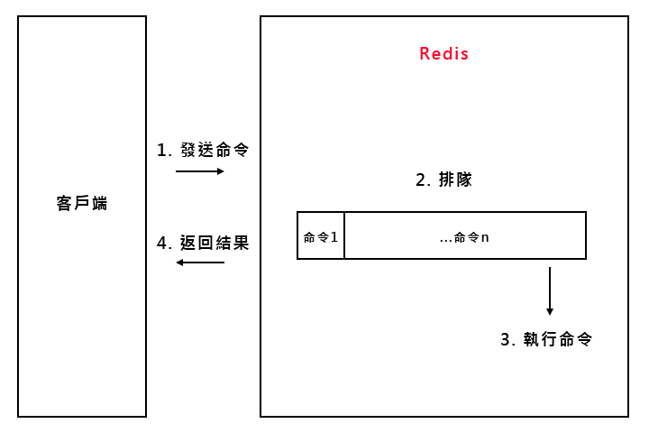

待分類/慢查詢
===
[回首頁](https://github.com/frank575/nn/) / [返回目錄](../../)

# 生命週期

* 慢查詢是發生在第三階段，執行命令時間長的命令，比方說 keys *
* 客戶端超時不一定為慢查詢，但慢查詢是客戶端超時的一個可能因素

# 兩個配置

## slowlog-max-len

1. 先進先出隊列
2. 固定長度
3. 保存在內存內

## slowlog-log-slower-than

1. 慢查詢閾值(單位：微秒)
2. slowlog-log-slower-than=0：記錄所有命令
3. slowlog-log-slower-than<0：不記錄所有命令

## 配置方法

1. 默認值
   * config get slowlog-max-len = 128
   * config get slowlog-log-slower-than = 10000
2. 修改配置文件重啟
3. 動態配置
   * config set slowlog-max-len 100
   * config set slowlog-log-slower-than 100

# 三個命令

1. `slowlog get [n]` 獲取慢查詢隊列
2. `slowlog len` 獲取慢查詢隊列長度
3. `slowlog reset` 清空慢查詢隊列

# 運維經驗

1. `slowlog-log-slower-than` 不要設置過大，默認 10ms，通常設置 1ms  
   * 因為通常 redis 的 qps 為萬級別的，如果達到 1ms 的吞吐量就會對性能有所影響
2. `slowlog-max-len` 不要設置過小，通常設置 1000 左右
   * 該隊列是存在內存當中的，當 redis 重啟後，他的列表就會進行清空，而且是先進先出的隊列，隨著慢查詢隊列的增加，先前的慢查詢就會丟失掉，後續要分析歷史會顯得不方便
3. 理解命令生命週期
   * 理解命令週期，較容易查出性能問題原因
4. 定期持久化慢查詢
   * 定期將慢查詢存到數據源(如 mysql 裡)，有利於分析歷史問題
