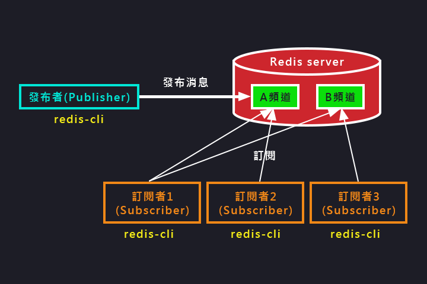

待分類/發布訂閱
===
[回首頁](https://github.com/frank575/nn/) / [返回目錄](../../)

# 角色與模型

* 發布者(publisher)
* 訂閱者(subscriber)
* 頻(通)道(channel)



(以上為發布訂閱的通信模型圖)

可以看到一個訂閱者可以訂閱多個頻道，而發布者發布了一條新的訊息至頻道中，訂閱頻道的訂閱者可以收到消息

> 需要注意的是：redis 不是真正的消息隊列，所以未提供消息堆積的功能，故訂閱者**新訂閱的頻道是無法收到先前的訊息**

# API

* `publish channel message` 發布 message 至 channel
* `subscribe [channel]` 訂閱頻道(可多個) 
* `unsubscribe [channel]` 取消訂閱頻道(可多個)
* 其他
  * `psubscribe [pattern...]` 訂閱模式
  * `punsubscribe [pattern...]` 退訂指定模式
  * `pubsub channels` 列出至少有一個訂閱者的頻道
  * `pubsub numsub [channel...]` 列出給定頻道的訂閱者數量
  * `pubsub numpat` 列出被訂閱模式的數量

```shell
# 演示代碼
> publish hola:tv "hello world"
(integer) 3 # 訂閱者個數

> subscribe hola:tv
1) "subscribe"
2) "hola:tv"
3) (integer) 1
1) "message"
2) "hola:tv"
3) "hello world"
```

# 與消息隊列的對比

消息隊列是搶佔式的(此處就不畫圖了)，只會有一位訂閱者能收到消息，可以使用 list 阻塞來處理，可用在搶紅包之類的功能上

而發布訂閱則是所有訂閱者都會收到消息


