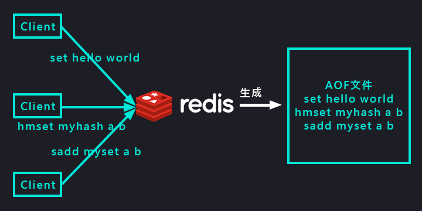

持久化/AOF
===
[回首頁](https://github.com/frank575/nn/) / [返回目錄](../../)

# RDB現存問題

1. 耗時；耗性能
   1. O(n)數據，所以耗時
   2. fork() 消耗內存, copy-on-write策略
   3. Disk I/O，IO 性能
2. 不可控、丟失數據
   1. 當在 save 時出現當機，那麼數據就丟失了

# 什麼是



(aof生成模型圖)

還原數據就是把 AOF 文件紀錄的指令重新執行生成數據

# AOF三種策略

* `always` 每條命令都會 fsync 到 aof 文件中
* `everysec` 每秒把緩衝區 fsync 到 aof 文件中，可能丟失數據
* `no` OS 決定 fsync

## 對比

命令|always|everysec(默認配置)|no
---|---|---|---
優點|不丟失數據|每秒一次fsync|不用管
缺點|IO開銷較大，一般的sata盤只有幾百TPS|丟一秒數據|不可控

# AOF 重寫

redis 用來優化 aof 載入性能的策略，查看以下事例

* 原生AOF
```shell
> set hello world
> set hello java
> set hello hehe
> incr counter
> incr counter
> rpush mylist a
> rpush mylist b
> rpush mylist c
> ...過期數據
```

* AOF重寫
```shell
# 因為 hello 最終為 hehe，所以壓縮為此
> set hello hehe
# 因為 counter incr 兩次，所以直接寫入 2
> set counter 2
# 因為 rpush 3 次，所以直接 rpush 3 筆
> rpush mylist a b c
# 過期數據就不寫入
```

使用AOF重寫策略來達到以下目的：
1. 減少硬盤占用量
2. 加速恢復速度

## 兩種實現方式

* `bgrewriteaof` 異步完成 aof 重寫，原裡似於 bgsave，此處就不再畫圖描述
* `AOF重寫配置`
   ```text
   auto-aof-rewrite-min-size   AOF文件重寫需要的尺寸(意為當AOF大小超過該大小後進行重寫)
   auto-aof-rewrite-percentage AOF文件增長率(意為下次重寫的大小增長率，比方說這次重寫後剩下100K，那麼增長率為100%，表示當檔案大小增加到200K時執行重寫)
   ```
* `AOF統計配置`
   ```text
   aof_current_size AOF當前尺寸(單位：字節)
   aof_base_size    AOF上次啟動和重寫的尺寸(單位：字節)
   ```

## 自動觸發時機

同時滿足以下條件自動重寫 AOF

* aof_current_size > auto-aof-rewrite-min-size
* aof_current_size - aof_base_size / aof_base_size > auto-aof-rewrite-percentage


# 配置

```text
appendonly yes # 默認為 no，如果要使用 aof 配置，需要設為 yes
appendfilename "appendonly-${port}.aof"
appendfsync everysync
dir /bigdiskpath
no-appendfsync-on-rewrite yes # 是否在 aof 重寫時 append aof
auto-aof-rewrite-percentage 100
auto-aof-rewrite-min-size 64mb
```
