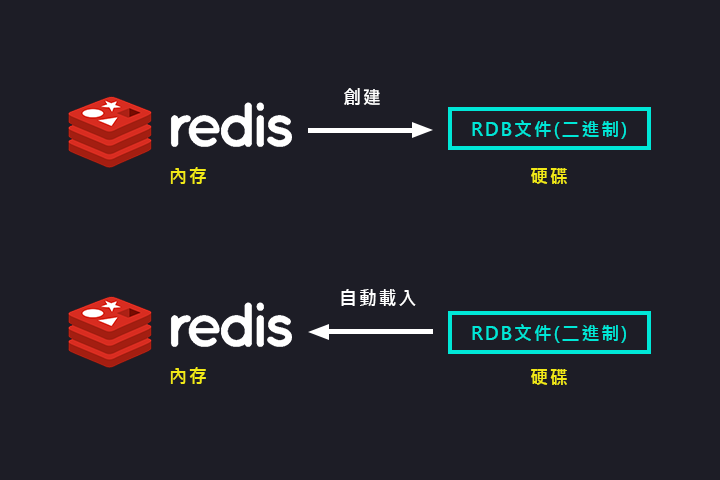
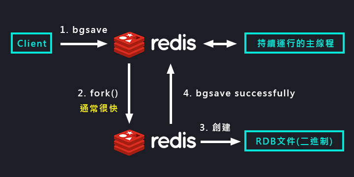

持久化/RDB
===
[回首頁](https://github.com/frank575/nn/) / [返回目錄](../../)

# 什麼是



(RDB模型圖)

> 這也是個複製的媒介，會在後續的主從複製中使用RDB

# 觸發機制

## 不容忽略方式

1. 全量複製，在後續主從複製會說明
   1. 當在進行主從複製時，主會自動生成RDB文件 
2. debug reload
3. shutdown

## 主要三種方式

1. `save` 同步
2. `bgsave` 異步
3. `自動` 達成特定條件時自動儲存

### save


* 同步
* 當數據量大時會阻塞
* 新的覆蓋RDB覆蓋老的RDB
* 複雜度為 O(n)

```shell
> save
OK
```
  
### bgsave



* 異步
* fork(通常情況下很快) 創建 redis 子進程進行快照拷貝
* 新的覆蓋RDB覆蓋老的RDB(同save)
* 複雜度為 O(n)(同save)

```shell
> bgsave
Background saving started
```

#### 與 save 對比

命令|save|bgsave
---|---|---
IO類型|同步|異步
阻塞|是|是(阻塞發生在fork)
複雜度|O(n)|O(n)
優點|不會消耗額外內存|不阻塞客戶端命令|
缺點|阻塞客戶端命令|需要fork，消耗內存|

### 自動生成RDB

滿足以下任一條件時執行 bgsave 生成 RDB文件，以下為默認配置

配置|seconds|changes|
---|---|---
save|900|1
save|300|10
save|60|10000

* 優點
  * 可以自動備份
* 缺點
  * 無法控制生成RDB的頻率

### 配置

* `dbfilename` 生成的RDB文件檔名，預設：dump.rdb
* `dir` 生成的目錄，預設：./
* `stop-writes-on-bgsave-error` bgsave 錯誤時是否停止寫入，預設：yes
* `rdbcompression` rdb文件是否壓縮，預設：yes
* `rdbchecksum` 是否對rdb文件進行檢驗，預設：yes


### 最佳配置

```shell
#save 900 1 將默認的自動生成註掉
#save 300 10
#save 60 10000
dbfilename dump-${port}.rdb # 通常會集群，所以使用 port 區分
dir /bigdiskpath
stop-writes-on-bgsave-error yes
rdbcompression yes
rdbchecksum yes
```
