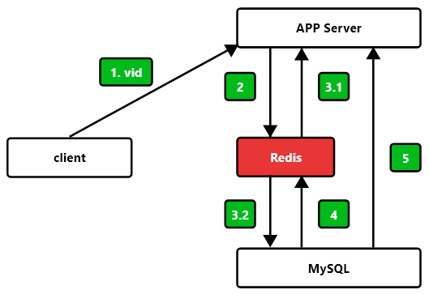

數據結構/字符串 string
===
[回首頁](../../../) / [返回目錄](../../)


* 鍵值結構 key-value，如下資料都可以存
	* word
	* 1
	* 1 0 1 1 1 1 0 1
	* { "product": { "id": "2951", name: "test1" } }
* 不能超過 512MB，建議 100K 內

### 命令

* `get key` 獲取 key value
	*  O(1)
* `set key value` 寫入 key value 
	* O(1)
* `del key [key ...]` 刪除 key 
	* O(1)
* `incr key` key 自增 1，如果 key 不存在，自增後 get(key) = 1 
	* O(1)
	* `decr key` key 自減 1
		* O(1)
	* `incrby key value` key 自增 k，如果 key 不存在，自增後 get(key) = k
		* O(1)
	* `decrby key value` key 自減 k
		* O(1)
	```redis=
	> get counter
	(nil)
	> incr counter
	(integer) 1
	> get counter
	"1"
	> incrby counter 99
	(integer) 100
	> get counter
	"100"
	> decr counter
	(integer) 99
	> get counter
	"99"
	```
* `set key value` 不管 key 是否存在，都設置
	* O(1)
	* `setnx key value` key 不存在，才設置
		* O(1)
		* 返回 integer
	* `set key value xx` key 存在，才設置
		* O(1)
		* 返回 nil 或 OK
	* `set key value ex s` 設置帶 expire 的 key
		* O(1)
* `mget key...` 批量獲取 key, 原子操作
	* O(n)
	* 批量 get 請走 mget，因為 redis 大部分命令讀寫速度超快，網絡時間才是最珍貴的
		* n 次 get 等於 n 次網路時間 + n 次命令時間
		* mget 等於 1 次網路時間 + n 次命令時間
	* 當然依然不建議一次操作過多筆，如 10 萬次，這樣建議拆分為 K * 100 次進行處理
* `mset (key value)...` 批量寫入 key, 原子操作
	* O(n)
* `getset key value` set key newvalue 後返回舊的 value
	* O(1)
* `append key value` 將 value 追加到舊的 value 
	* O(1)
* `strlen key` 返回字符串長度(注意中文)
	* O(1)
* `incrbyfloat` 浮點數自增
	* O(1)
* `getrange key start end` 獲取字符串指定下標所有的值
	* O(1)
* `setrange key index value` 設置指定下標所有對應的值
	* O(1)
		
### 使用場景

1. 緩存
	* 緩存視頻的基本信息(數據源在MYSQL中)偽代碼
	
	```typescript=
	const getVideoInfo = (vid: number): VideoInfo => {
		const redisKey: string = redisPrefix + vid
		let videoInfo: VideoInfo = parse<VideoInfo>(redis.get(redisKey))
		if (videoInfo == null) {
			videoInfo = mysql.get(vid)
			if (videoInfo != null) {
				// 序列化
				redis.set(redisKey, serialize(videoInfo))
			}
		}
		return videoInfo
	}
	```
2. 計數器
	* 紀錄用戶頁面訪問數量
		```redis=
		> incr user_id:pageview
		(integer) 1
		> incr user_id:pageview
		(integer) 2
		# ...
		```
4. 分布式鎖
	* 分布式 id 生成器
		* incr id
6. jwt token 黑名單
7. ...


### 內部編碼