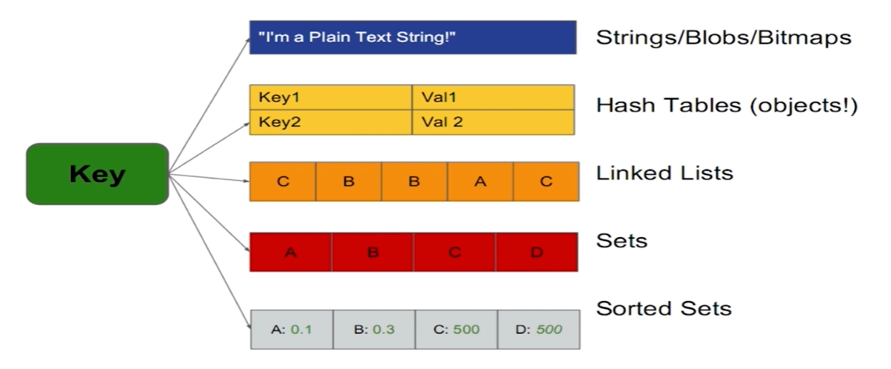
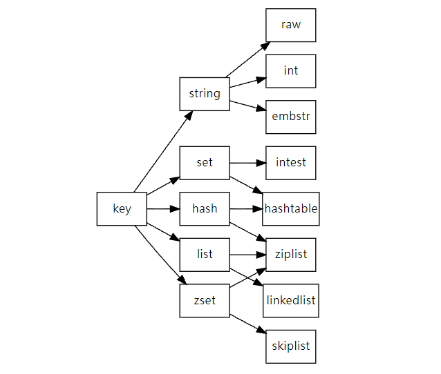

舊/簡介及安裝
===
[回首頁](https://github.com/frank575/nn/) / [返回目錄](../../)

# 是什麼

- 開源
- 基於鍵值(key-value)的存儲服務系統服務
- 多種數據結構
- 性能高且功能豐富

---

# 特性

- 速度快
- 持久化(aof, rdb)
- 多種數據結構
- 支持多種編程語言
- 功能豐富
- 簡單
- 主從複製
- 高可用、分布式

## 1. 速度快

- 10W qps(讀寫 / s)

### 為什麼這麼快

- 數據存在內存
- 使用約 5W 行 C 語言實現
- 非阻塞 IO
- 單線程線程模型(因為數據寫入內存，所以單線程得以發揮其性能)

類型|每秒讀寫次數|隨機讀寫延遲|訪問帶寬
---|---|---|---
內存|千萬級|80ns|5GB
SSD盤|35000|0.1-0.2ms|100~300MB
10ms|機械盤|100左右|100MB左右  


### 需要注意什麼

1. 一次只運行一條命令
2. 拒絕長(慢)命令
	如：keys, flushall, flushdb, slow lua script, mutil/exec, operate, big value(collection
3. 也有不是單線程的(題外話)
	fysnc file descriptor
	close file descriptor
    
## 2. 持久化(斷電不丟數據)

Redis 所有數據保存在內存中，對數據的更新將異步保存到硬盤上

## 3. 多種數據結構



在新的版本迭帶中還提供了幾種特性(主要都算是字符串結構)

- BitMaps 位圖
    - 可以用很小的內存達成高效的存儲
- HyperLogLog 超小內存(12K)唯一值計數
- GEO 地理信息地位 可以用來算經緯度

## 4. 多語言客戶端

Java, Python, Php, Ruby, Lua, Node, Golang, ...

## 5. 功能豐富

- 發布訂閱
- Lua 腳本
- 事務
- pipeline

## 6. 簡單

- 不依賴外部庫
- 分布式版本單機實現約 2W3 行 C 代碼
- 單線程模型

## 7. 主從複製

<!-- 對於高可用有很好的優勢 -->

## 8. 高可用分布式

單點式與主從複製模型對於高可用、分布式較難以實現，但後續更新中滿足了

- 高可用 Redis-Sentinel(v2.8)
- 分布式 Redis-Cluster(v3.0)

---

# 典型應用場景

- 緩存系統(雖然很多人認為 Redis 就是緩存，但並不是，不過在緩存上 Redis 有很好的表現)
- 計數器
- 消息對列系統(發布訂閱、阻塞隊列)
- 排行榜
- 社交網路
- 實時系統

## 緩存系統

以下是典型的緩存系統模型


為了增加數據的吞吐量，server 會先向緩存(此用 redis)查找數據返回，找不到再去數據層(mysql等)查找後存到緩存並返回

## 計數器

轉發數、評論數等，皆可以仰賴 redis 的功能做高效計數

## 消息隊列系統

雖然現在有許多成熟的消息對列系統(如 RabbitMQ 等)，但是 Redis 也提供了如發布訂閱、阻塞隊列來實現類似的模型，對消息對烈要求的需求不是很強時，完全可以使用類似 Redis 來實現(也不會因為使用其他 MQ 而造成提升技術棧)

## 排行榜


例如提供的有序集合可以有效處理類似場景

## 社交網路

與社交網路天然吻合，如：粉絲數、關注數、共同關注、時間軸列表等，像 weibo、twitter 都使用 Redis 來實現

## 實時系統

垃圾郵件過濾等

---

# 三種啟動方式

## 安裝

### windows

基本相性不佳，可以裝補丁裝，此處就省篇幅不介紹了

### Linux、Mac

```shell
$ wget https://download.redis.io/releases/redis-6.0.9.tar.gz
$ tar -xzf redis-6.0.9.tar.gz
$ ln -s redis-6.0.9 redis
$ cd redis
$ make && make install
```

### docker

```shell
$ docker pull redis
$ docker run -itd --name redis1 -p 6379:6379 redis
```

## 可執行文件說明

- redis-server Redis 服務器
- redis-cli Redis 命令行客戶端
- redis-benchmark Redis 性能測試工具
- redis-check-aof AOF 文件修復工具
- redis-check-dump RDN 文件檢測工具
- redis-sentinel Sentinal 服務器

## 三種啟動方法

### 最簡啟動

直接執行 redis-server (使用 redis 默認配置)

### 動態參數啟動

- redis-server --port 6380
    - Redis 默認啟動端口為 6379，可以使用 --port 更改

### 配置文件啟動

- redis-server configPath

### 驗證是否啟動

- ps -ef | grep redis 查看進程
- netstat -antpl | grep redis 查看端口是否 listen
- redis-cli -h ip -p port ping 

### 比較

- prod 環境建議使用**配置啟動**
    - 單機多實例配置文件可用端口區分開
    - 服務器多為多核，所以一台機器可能會部屬多台 Redis，用配置文件處理比較方便

## 簡單的客戶端連結

直接使用 redis-cli 連結，如：

```shell
$ redis-cli -h 10.10.79.150 -p 6384
$ ping
PONG
$ set hello world
OK
$ get hello
"world"
```

### 客戶端返回值

- 狀態回復
    ```shell
    $ ping
    PONG
    ```
- 錯誤回復
    ```shell
    $ hget hello field
    (error) WRONGTYPE Operation against
    ```
- 整數回復
    ```shell
    $ incr hello
    (integer) 1
    ```
- 字符串回復
    ```shell
    $ get hello
    "world"
    ```
- 多行字符串回復
    ```shell
    $ mget hello foo
    1) "world"
    2) "bar"
    ```
    
---

# 常用配置

可以用 config get * 取得所有配置

- daemonize 是否是守護進程(no|yes)，默認 no 建議 yes
    - 啟用後會將日誌打印到配置的目錄當中
- port Redis 對外端口號(默認 6379)
- logfile Redis 系統日誌
- dir Redis 工作目錄

---

# 通用令命

- keys 計算 redis 所有的鍵
- dbsize 計算數據庫大小
- exists key key 是否存在
- del key [key ...] 刪除 key
- expire key seconds 設定 key 過期時間(緩存的使用場景很有幫助)
- type key 查看數據類型

## keys *
> 遍歷所有key
* **一般不在生產環境中使用**
* 多用在**熱備從節點(2-2)**及**scan**上
* 時間複雜度 O(n)
```shell
> set hello world
OK
> set js good
OK
> keys *
1) "hello"
2) "js"
> dbsize
(integer) 2
```
### `keys [pattern]`
> 使用通配符查找
```shell
# 通配符類似於正則
keys he*
keys he[h-l]*
keys ph?
```

## dbsize
> 計算 key 的總數
* 時間複雜度 O(1)

## exists key 
> 檢查 key 是否存在
* 僅返回 0 與 1
* 時間複雜度 O(1)
```shell
> set a b
OK
> exists a
(integer) 1
> del a
(integer) 1
> exists a
(integer) 0
```

## get key
> 返回 key 的 value
* 時間複雜度 O(1)
```shell
> set hello world
OK
> get hello
"world"
> get aaa
(nil)
```

## del key [key ...]
> 刪除指定的 key-value
* 返回刪除個數
* 時間複雜度 O(1)
```shell
> set a b
OK
> get a
"b"
> del a
(integer) 1
> get a
(nil)
> del k1 k2 k3
(integer) 0
```

## expire key seconds
> key 在 seconds 秒後過期
* 時間複雜度 O(1)
```shell
> set h w
OK
> expire h 10
(integer) 1
> ttl h
(integer) 9
> ttl h
(integer) 6
> persist h
(integer) 1
> ttl h
(integer) -1
> expire h 5
(integer) 1
> keys h
(empty list or set)
```

## ttl key
> 查看 key 剩餘的過期時間
* 返回剩餘秒數，特例：-1 key 存在且無剩餘過期時間、-2 key 已不存在
* 時間複雜度 O(1)

## persist key
> 去除 key 的過期時間
* 返回去除的 key 個數
* 時間複雜度 O(1)

## type key
> 返回 key 的類型
* 返回的類型有
	* string, hash, list, set, zset
	* none 不存在的 key
* 時間複雜度 O(1)
```shell
> set a b
OK
> type b
string
> sadd myset 123
(integer) 3
> type myset
set
```

---

# 數據結構和內部編碼


