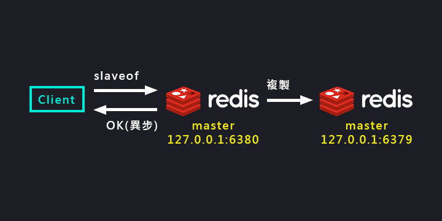

複製原理與優化/什麼是主從複製
===
[回首頁](https://github.com/frank575/nn/) / [返回目錄](../../)

# 單機有什麼問題

在理解什麼是主從複製前，先讓我們瞭解什麼是單機，單機為在一個機器上部屬一個 redis 節點

## 問題

1. 機械故障
2. 容量瓶頸
3. QPS瓶頸

# 什麼是主從複製

`master(主)` <-> `slave(從)` <-> `slave(從)...`

Redis 的主從複製機制是指可以讓從結點能精準複製主節點的數據

* 數據流是單向的，主到從
* 一個主可以多個從
* 一個從只能有一個主
* 一個從也能是一個主
* 為高可用提供良好的積澱

## 作用

1. 數據副本
2. 擴展讀性能


# 實現方式

## slaveof 命令



(slaveof 命令示意圖)

* `slaveof ip:port` 主從複製，會把主數據覆蓋至從
* `slaveof no one` 取消複製，不會把先前複製的數據清除

```shell
# 將 6380 port 的 redis 設定為 6379 的從結點
redis-6380 > slaveof 127.0.0.1:6379
OK

redis-6380 > slaveof no one
OK
```

## 配置

```text
slaveof ip port
slave-read-only yes # 表示從僅能讀，不建議從寫，這樣主不知道數據更新
```

## 兩者比較

方式|命令|配置
---|---|---
優點|無須重啟|統一配置
缺點|不便於管理|需要重啟
